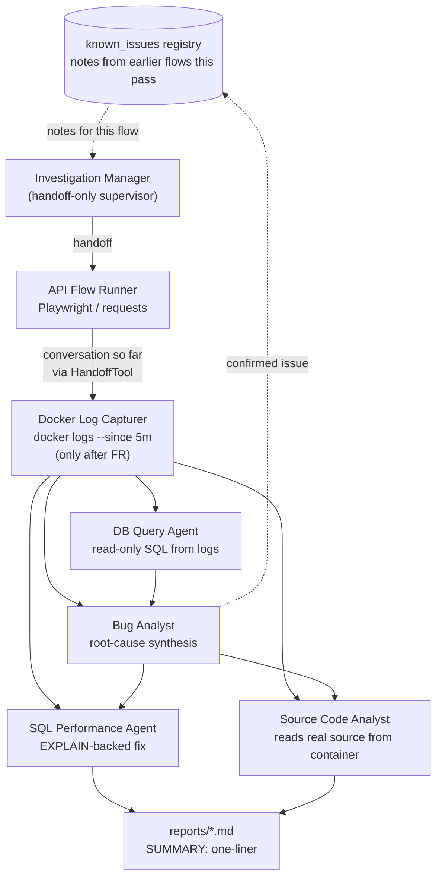

# bee-bug-hunter

Autonomous bug-hunting crew built on the [BeeAI framework](https://github.com/i-am-bee/beeai-framework) —
a port of `crew-bug-hunter` (CrewAI) with the same features:

- An **Investigation Manager** supervisor agent delegates (via handoff tools, never running
  domain tools itself) to six workers: API Flow Runner (Playwright / requests), then
  Docker Log Capturer (structurally enforced to run only after the flow runner), then —
  each gated on the log capturer having run — DB Query Agent, Bug Analyst, SQL
  Performance Agent, and Source Code Analyst (reads the app's real source, copied out of
  its container, to confirm/refute a hypothesis against the actual implementation).
- Flows are YAML files in `bee_bug_hunter/flows/`; the batch to monitor is listed in
  `bee_bug_hunter/manifest.yaml`.
- Cross-flow known-issues sharing: confirmed findings from earlier flows in the same
  batch pass are surfaced as notes to later flows, but the manager independently
  re-verifies relevance rather than trusting a note at face value.
- Switchable LLM providers via `LLM_PROVIDER` in `.env`: `ollama` (default, local, no API
  key), `openai`, or `anthropic`.
- Structured JSONL logging with a per-run `run_id` correlation id; one markdown report per
  flow run in `reports/`.
- A Textual TUI (`python -m bee_bug_hunter.tui`).

## Architecture



## Setup

```bash
python -m venv .venv && source .venv/bin/activate
pip install -r requirements.txt
playwright install chromium
cp .env.example .env  # fill in LLM_PROVIDER, MySQL creds, etc.
```

## Running

```bash
python -m bee_bug_hunter.main --once     # one pass over every flow, then exit
python -m bee_bug_hunter.main            # continuous monitor
```

## TUI

```bash
source .venv/bin/activate
python -m bee_bug_hunter.tui
```

Reads `.env` and `bee_bug_hunter/manifest.yaml` on launch, and writes the same
JSONL trail to `logs/bee_bug_hunter.jsonl` as the CLI. Four screens:

1. **Home** — what the app does, the agent roster, and the active LLM/MySQL config
   plus per-flow overrides. Press `r` to pick UI flows, `a` for API flows.
2. **Select Flows** — tick the flows to run, hit **Run Selected**, and watch the
   live event feed while the investigation runs.
3. **Anomaly Signals** — deterministic bug/perf signals per flow (from the raw
   flow-runner / log-capturer tool output). Press `n` for the reports.
4. **Results** — each flow's Bug Analyst / SQL Performance report (or the manager's
   summary when no specialist was escalated to), with the saved `reports/*.md` path.

`escape` goes back, `q` quits.

## Local test target: `demo_app/`

Dockerized Flask + MySQL app with two seeded issues (a login handler referencing a
nonexistent `passwd` column causing every login to 500, and an N+1 query on
`/api/orders/<user_id>`):

```bash
cd demo_app && docker compose up --build -d
cd .. && python -m bee_bug_hunter.main --once
```

